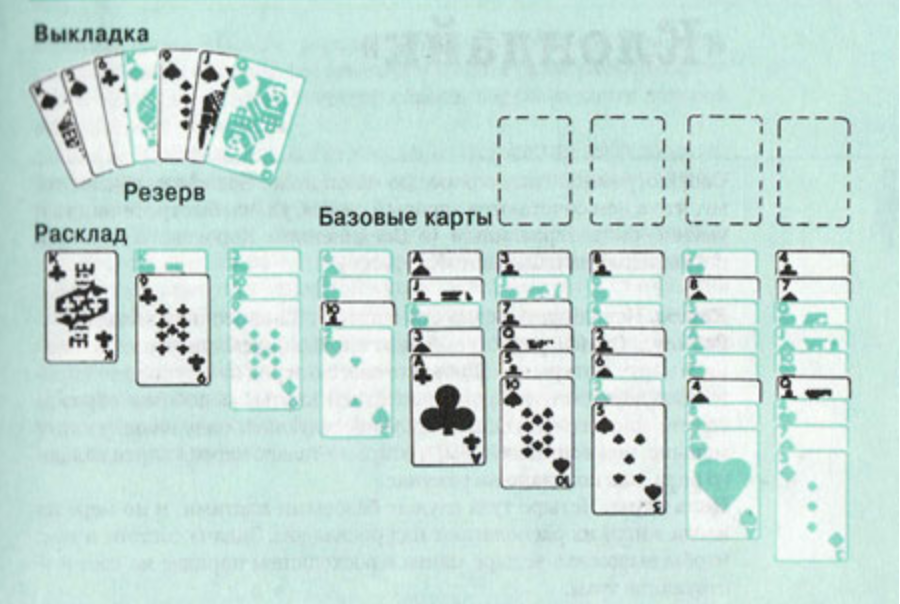

## Карточный пасьянс «Король Альберт»
Этот пасьянс назван в честь короля Бельгии Альберта 1, который во время Первой мировой войны возглавил армию своей страны против немцев. Карты расклада и «бельгийского резерва» выкладываются на четыре базовые карты.

## Карты.
Используется одна стандартная колода.
## Расклад.
Сорок пять карт сдаются в открытую рядами слева направо, образуя расклад из девяти колонок.
Первая колонка состоит из одной карты, вторая колонка — из двух и т. д. — в последней колонке девять карт.
Карты каждой колонки должны располагаться внахлест так, чтобы все они были видны. Оставшиеся семь карт, известные как «бельгийский резерв», можно либо держать в руке, либо разложить веером рядом с раскладом.
## Цель игры.
Состоит в том, чтобы высвободить четыре туза (базовые карты) и по мере их ввода в игру расположить над раскладом. На них в восходящей последовательности в масть выкладываются карты, от туза до короля.
## Правила игры.
Все карты резерва можно разыгрывать, как и открытые карты расклада.
За один ход можно перемещать только одну карту — либо на базе, либо в нисходящем чередующемся по цвету порядке на колонки расклада.
Если на месте всей колонки образуется свободное место, его можно заполнить любой свободной картой.
Игрок может по желанию перемещать карты с баз в расклад с учетом того, что они вписываются в правильную числовую и цветовую последовательности.
