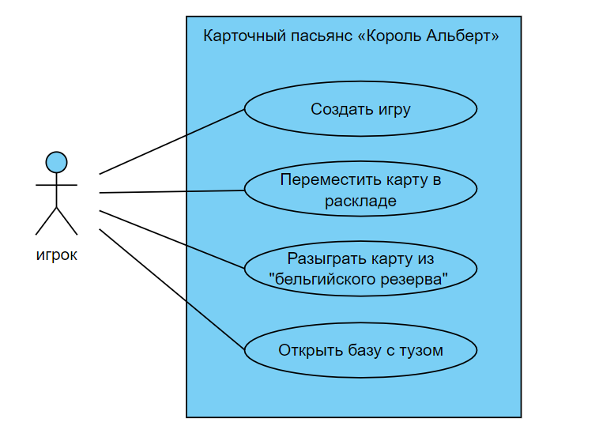

# Лабораторная работа №1
**9.Карточный пасьянс «Король Альберт»**

### Диаграмма прецедентов

---
## Прецедент "Создать игру"
**Описание**: Подготовка к созданию игры - настройка параметров игры (имя пользователя), раздача карт, расположение карт на столе.
- **Основной исполнитель**: Игрок
- **Предусловие**: Приложение готово к запуску.
- **Постусловие**: Игра создана

### Основной успешный сценарий
| Пользователь         | Система                                           | 
|----------------------|---------------------------------------------------|
| 1. Запускает приложение. |                                                   | 
| 2. Вводит свое имя. |                                                 | 
|  | 3. Создает игру с указанным именем пользователя.                                                  |
|                      | 4. Формирует начальное состояние игры, включая расклад карт на столе.    |

### Альтернативный сценарий "Неверный ввод"
| Пользователь                                  | Система                                     | 
|-----------------------------------------------|---------------------------------------------|
| 1. Запускает приложение.           |                                             | 
|    2. Не вводит свое имя.                                             |  |
|                                      |  3. Показывает сообщение об ошибке и просит повторить ввод имени пользователя.

---
## Прецедент "Переместить карту в раскладе"
**Описание** Игрок перемещает карту из одной колонки расклада в другую с учетом правил расклада.
- **Основной исполнитель**: Игрок
- **Предусловие**: Игра запущена, игровой расклад разложен.
- **Постусловие**: Карта успешно перемещена в другую колонку расклада.

### Основной успешный сценарий
| Пользователь         | Система                                           | 
|----------------------|---------------------------------------------------|
| 1. Выбирает карту из колонки расклада, которую хочет переместить.   |                                                   | 
|   2.  Выбирает целевую колонку, в которую он хочет переместить карту.                  |              |
|                      | 3. Проверяет, соответствует ли перемещение правилам расклада. |
|                      | 4. Перемещает карту  в целевую колонку. |

### Альтернативный сценарий "Невозможный ход"
| Пользователь         | Система                                           | 
|----------------------|---------------------------------------------------|
| 1.  Пытается осуществить недопустимый ход. |                                    | 
|                      | 2.  Показывает сообщение об ошибке и запрашивает у игрока выполнение корректного хода.                |

---
## Прецедент "Разыграть карту из "бельгийского резерва" "
**Описание**: Игрок выбирает карту из "бельгийского резерва" и разыгрывает ее на базу или на колонку расклада.
- **Основной исполнитель**: Игрок
- **Предусловие**: Игра запущена, на руках игрока есть карты для разыгрывания.
- **Постусловие**: Состояние игры обновлено после разыгрывания карты.

### Основной успешный сценарий
| Пользователь                         | Система                             | 
|--------------------------------------|-------------------------------------|
| 1.Выбирает карту из "бельгийского резерва".    |                                     | 
|   2. Определяет место для разыгрывания карты: на базу или на колонку расклада.                                   ||
  | | 3. Разыгрывает выбранную карту в соответствии с правилами игры.
|                                      | 4. Обновляет состояние игры.  |
 

### Альтернативный сценарий "Невозможность разыгрывания"
| Пользователь                            | Система                                   | 
|-----------------------------------------|-------------------------------------------|
| 1. Пытается разыграть карту, но нарушает правила игры. |                                           | 
|                                         | 2. Выводит сообщение об ошибке и предлагает игроку сделать другой ход, соблюдая правила. 

---
## Прецедент "Открыть базу с тузом"
**Описание**: Игрок открывает новую базу, начиная ее с туза.
- **Основной исполнитель**: Игрок
- **Предусловие**: Игра запущена, на руках игрока есть туз.
- **Постусловие**: Новая база успешно открыта с тузом.

### Основной успешный сценарий
| Пользователь                    | Система                                               | 
|---------------------------------|-------------------------------------------------------|
| 1.  Выбирает туза из своих карт.           |                                                       | 
|     2. Указывает на пустое место для новой базы  .                         |      |
|                                 | 3. Создает новую базу и помещает выбранный туз в качестве первой карты в базе.            |
|                                 | 4. Обновляет состояние игры.            |

### Альтернативный сценарий "Невозможное открытие без туза"
| Пользователь                        | Система                                    | 
|-------------------------------------|--------------------------------------------|
| 1. Не имеет на руках туза.         |                                            | 
|    2. Пытается открыть новую базу без туза.                                |   |
|                                   | 3.  Выводит сообщение об ошибке и предлагает игроку выполнить действие согласно правилам.    |
