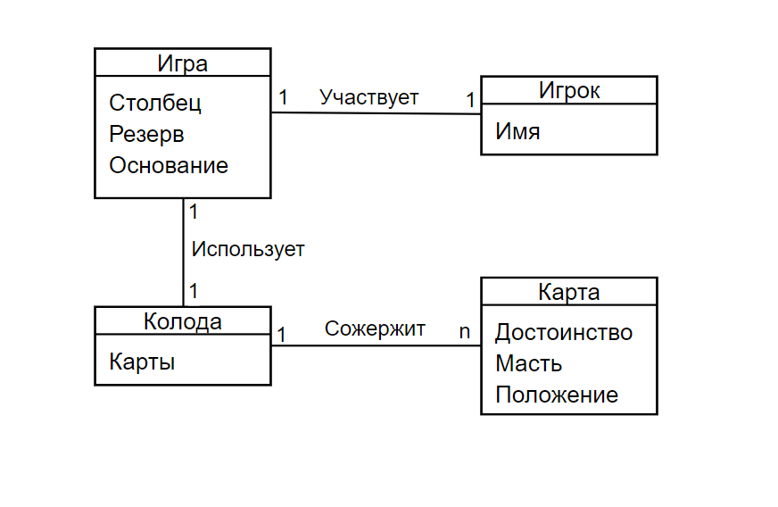

# Лабораторая работа №2
**Проект: Карточный пасьянс «Король Альберт»**

Entity–relationship model

## Сущности и их свойства:
### Игрок 
Описывает состояние игрока

Свойства:
- "Имя" — Строка - представляет имя игрока.
 ### Игра 
Описывает визуальное представление и структуру.

Свойства:
- "Столбцы" — Места, где расположены карты в начале игры.
- "Резерв" — Дополнительные карты, доступные для игры.
- "Основания" — Целевые стопки для каждой масти.

### Колода 
Описывает колоду карт, из которой раскладывается пасьянс.

Свойства:
- "Карты" — Набор из 52 игральных карт, используемых для начального распределения по столбцам и резерву.

### Карта    
Описывает состояние каждой игральной карты.

Свойства:
- "Достоинство" — Значение карты, например, от двойки до туза.
- "Масть" — Масть карты, например, пики или сердца.
- "Положение" — Текущее местоположение карты, будь то столбец, резерв или основание.

---

## Связи:
### Игрок - Игра (один к одному)
Каждый игрок может участвовать только в одной игре.

### Игра - Колода (один к одному)
Каждая игра использует только одну колоду.

### Колода - Карта (один ко многим)
Каждая колода содержит множество карт.
