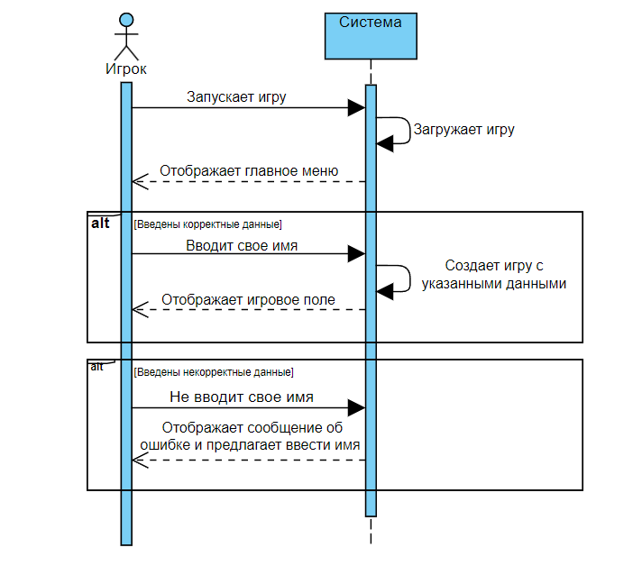
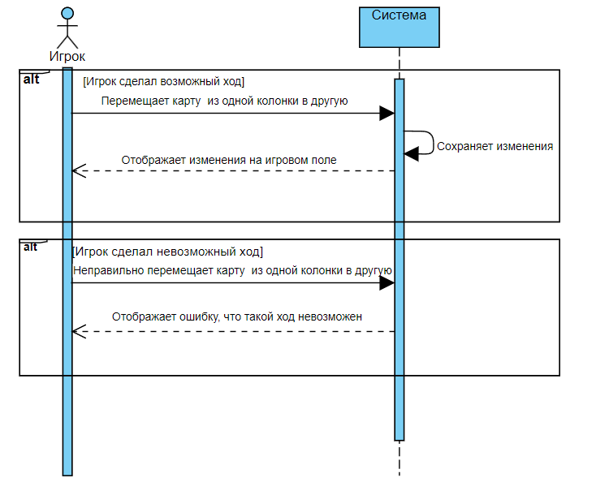
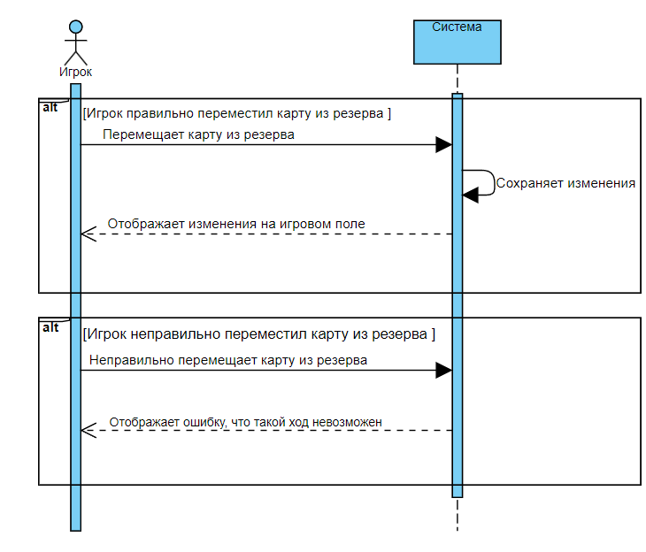
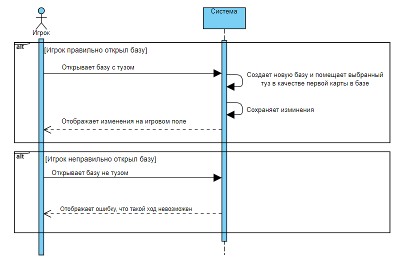

# Лабораторая работа №3
**Проект: 9.Карточный пасьянс «Король Альберт»**

Sequence diagram

## Прецедент "Создать игру"

**Основной вариант**

| Операция    | Ввод имени | 
|-------------|-------------------------------|
| Ссылки      | Прецедент "Создать игру"       | 
| Предусловие | Приложение запущено	          |
| Постусловие | Игра создана |

**Альтернативный вариант**

| Операция    | Неверный ввод имени                     | 
|-------------|--------------------------------------------------------------|
| Ссылки      | Прецедент "Создать игру"                                      | 
| Предусловие | Приложение запущено	                                         |
| Постусловие | Игра возвращается в состояние ввода имени|

---

## Прецедент "Переместить карту в раскладе"

| Операция    | Переместить карту из колнки в другую                              | 
|-------------|--------------------------------------------|
| Ссылки      | Прецедент "Переместить карту в раскладе" | 
| Предусловие | Игрок переместил карту.	       |
| Постусловие | Отбражены изменения на игровом поле                |

**Альтернативный вариант**

| Операция    |  Неправильно переместить карту из колнки в другую                      | 
|-------------|--------------------------------------------------------------|
| Ссылки      | Прецедент "Переместить карту в раскладе"                                      | 
| Предусловие | Игрок не правильно перестил карту.                                         |
| Постусловие | Ошибка|
---

## Прецедент "Разыграть карту из "бельгийского резерва""

| Операция    | Переместить карту из резерва                                              | 
|-------------|-----------------------------------------------------------|
| Ссылки      | Прецедент "Разыграть карту из "бельгийского резерва""                                 | 
| Предусловие | Игрок разыграл карту из резерва. 	 |
| Постусловие | Отбражены изменения на игровом поле                             |

**Альтернативный вариант**

| Операция    |  Неправильно переместить карту из резерва                      | 
|-------------|--------------------------------------------------------------|
| Ссылки      | Прецедент "Разыграть карту из "бельгийского резерва""                                      | 
| Предусловие | Игрок не правильно разыграл карту из резерва.                                         |
| Постусловие | Ошибка|
---

## Прецедент "Открыть базу с тузом"

| Операция    | Открыть базу с тузом                                                                     | 
|-------------|--------------------------------------------------------------------------------------------|
| Ссылки      | Прецедент "Открыть базу с тузом"                                                                  | 
| Предусловие | Игрок открыл базу тузом.	                                                                               |
| Постусловие | Создана новая база  |

**Альтернативный вариант**

| Операция    |  Открыть базу не тузом                      | 
|-------------|--------------------------------------------------------------|
| Ссылки      | Прецедент "Открыть базу с тузом"                                      | 
| Предусловие | Игрок открыл базу не тузом.                                         |
| Постусловие | Ошибка|
---
