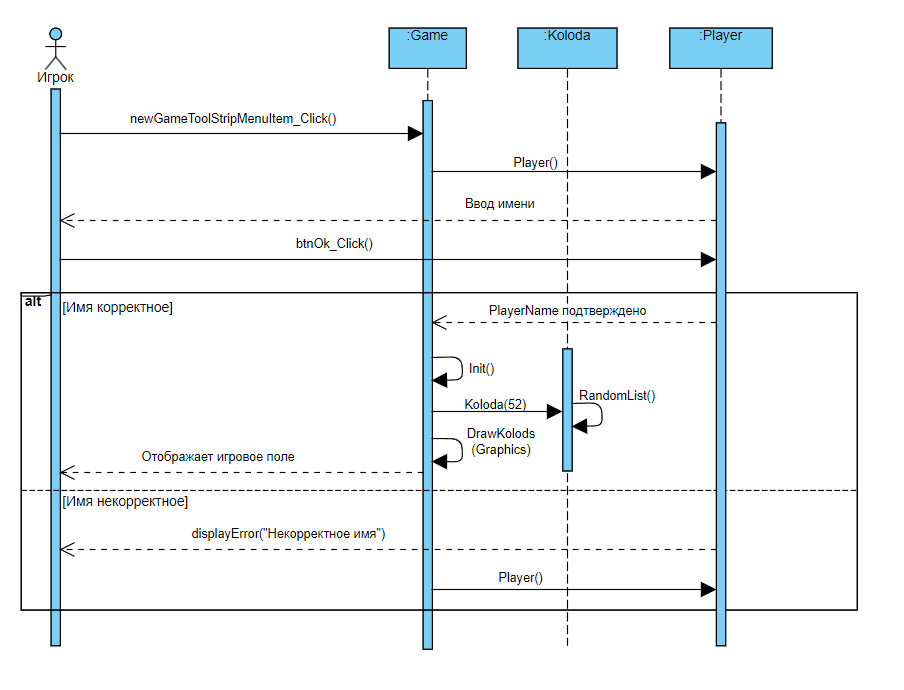
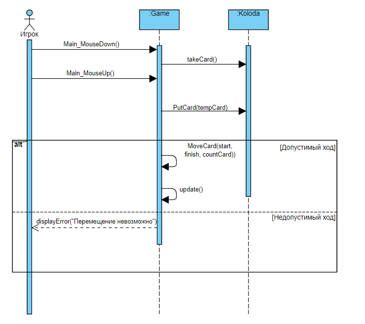
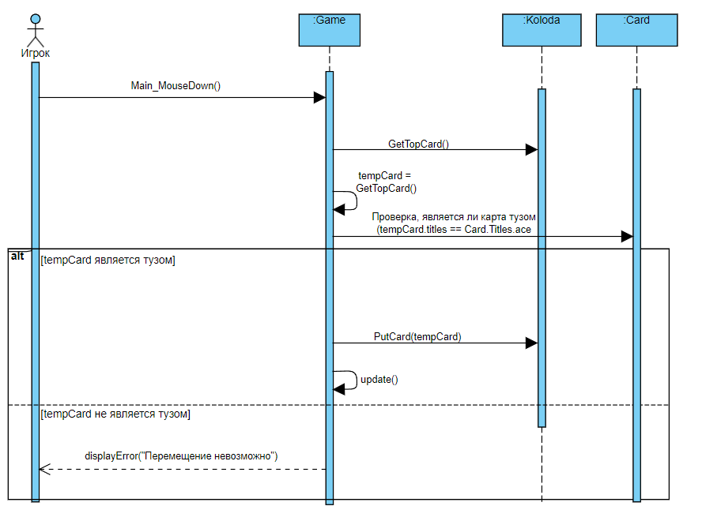

# Лабораторая работа №4
**Проект: 9.Карточный пасьянс «Король Альберт»**

Sequence diagram внутри системы

## Описание классов

### Card
**Описание**: Описывает отдельную карту.

**Свойства**:
- `Titles titles`: название карты.
- `Suit suit`: масть карты.
- `Bitmap img`: изображение карты.

**Методы**:
- `Card(Suit _suit, Titles _title)`: конструктор для создания карты.
- `Bitmap GetImgCard()`: метод для получения изображения карты.

**Перечисления**:
- `enum Titles`: список названий карт (туз, два, три, четыре, пять, шесть, семь, восемь, девять, десять, валет, дама, король).
- `enum Suit`: список мастей карт (черви, бубны, пики, трефы).

### Koloda
**Описание**: Описывает колоду карт.

**Свойства**:
- `List<Card> koloda`: список карт в колоде.

**Методы**:
- `Koloda()`: конструктор для инициализации пустой колоды.
- `Koloda(int countCard)`: конструктор для инициализации колоды с заданным количеством карт.
- `void RandomList()`: метод для перемешивания карт в колоде.
- `void PutCard(Card card)`: метод для добавления карты в колоду.
- `void PutCard(List<Card> cards)`: метод для добавления нескольких карт в колоду.
- `Card GetUpCard()`: метод для получения последней карты в колоде.
- `Card TakeCard()`: метод для взятия карты из колоды.
- `List<Card> TakeCards(int count)`: метод для взятия нескольких карт из колоды.
- `Card GetTopCard()`: метод для получения верхней карты в колоде.
- `Bitmap GetTopCardImage()`: метод для получения изображения верхней карты в колоде.
- `int Count`: свойство для получения количества карт в колоде.

### Game
**Описание**: Описывает игру, включая логику и интерфейс.

**Свойства**:
- `int selectKoloda`: индекс выбранной колоды.
- `bool isDown`: флаг, указывающий на нажатие кнопки мыши.
- `bool isUp`: флаг, указывающий на отпускание кнопки мыши.
- `static Card tempCard`: временная карта, используемая для перемещения.
- `static List<Card> tempCard_array`: список временных карт, используемых для перемещения.
- `Point mousePos`: позиция мыши.

**Методы**:
- `void Init()`: метод для инициализации игры.
- `void DrawCard(Graphics g, Card card, Point point)`: метод для рисования карты.
- `void MoveCard(int start, int finish, int countCard)`: метод для перемещения карт между колодами.
- `void IsFinish()`: метод для проверки окончания игры.
- `void DrawReserve(Graphics g)`: метод для рисования резервных карт.
- `void DrawKolods(Graphics g)`: метод для рисования всех колод.
- `void newGameToolStripMenuItem_Click(object sender, EventArgs e)`: метод для начала новой игры.
- `void exitToolStripMenuItem_Click(object sender, EventArgs e)`: метод для выхода из игры.
- `void UpdateScore()`: метод для обновления счёта.
- `void Main_MouseUp(object sender, MouseEventArgs e)`: метод обработки события отпускания кнопки мыши.
- `void Main_MouseDown(object sender, MouseEventArgs e)`: метод обработки события нажатия кнопки мыши.
- `void Main_MouseMove(object sender, MouseEventArgs e)`: метод обработки события перемещения мыши.
- `void Main_Paint(object sender, PaintEventArgs e)`: метод для рисования элементов игры.
- `void update()`: метод для обновления интерфейса игры.

### Player
**Описание**: Описывает форму для ввода имени игрока.

**Свойства**:
- `string PlayerName`: имя игрока.

**Методы**:
- `Player()`: конструктор для создания формы.
- `void btnOk_Click(object sender, EventArgs e)`: метод для обработки нажатия кнопки "ОК".

## Прецедент "Создать игру"

### Основной вариант

| Операция                | newGameToolStripMenuItem_Click()                       | 
|-------------------------|--------------------------------------------------------|
| Ссылки                  | Прецедент "Создать игру"                               | 
| Предусловие             | Нажата кнопка "Новая игра"                             |
| Постусловие             | Игра готова к запуску                                  |

| Операция                | Player()                                               | 
|-------------------------|--------------------------------------------------------|
| Ссылки                  | Прецедент "Создать игру"                               | 
| Предусловие             | Нажата кнопка "Новая игра"                             |
| Постусловие             | Форма для ввода имени игрока отображена                |

| Операция                | btnOk_Click()                                          | 
|-------------------------|--------------------------------------------------------|
| Ссылки                  | Прецедент "Создать игру"                               | 
| Предусловие             | Введено имя игрока                                     |
| Постусловие             | Имя игрока подтверждено                                |

| Операция                | Init()                                                 | 
|-------------------------|--------------------------------------------------------|
| Ссылки                  | Прецедент "Создать игру"                               | 
| Предусловие             | Имя игрока подтверждено                                |
| Постусловие             | Игровые компоненты инициализированы, карты разданы     |

| Операция                | Koloda(int countCard)                                  | 
|-------------------------|--------------------------------------------------------|
| Ссылки                  | Прецедент "Создать игру"                               | 
| Предусловие             | Метод Init() выполнен                                  |
| Постусловие             | Создана колода карт                                    |

| Операция                | RandomList()                                           | 
|-------------------------|--------------------------------------------------------|
| Ссылки                  | Прецедент "Создать игру"                               | 
| Предусловие             | Создана колода карт                                    |
| Постусловие             | Карты в колоде перемешаны                              |

| Операция                | DrawKolods(Graphics g)                                 | 
|-------------------------|--------------------------------------------------------|
| Ссылки                  | Прецедент "Создать игру"                               | 
| Предусловие             | Карты в колоде перемешаны                              |
| Постусловие             | Игровое поле отображено на экране                      |

### Альтернативный вариант — некорректные данные

| Операция                | displayError("Некорректное имя")                      | 
|-------------------------|--------------------------------------------------------|
| Ссылки                  | Прецедент "Создать игру"                               | 
| Предусловие             | Введено некорректное имя игрока                        |
| Постусловие             | Игра уведомила игрока о некорректном имени             |

| Операция                | Player()                                               | 
|-------------------------|--------------------------------------------------------|
| Ссылки                  | Прецедент "Создать игру"                               | 
| Предусловие             | Имя игрока некорректно                                 |
| Постусловие             | Форма для ввода имени игрока отображена повторно       |

## Прецедент "Переместить карту в раскладе"

### Основной вариант

| Операция                | Main_MouseDown()                                       | 
|-------------------------|--------------------------------------------------------|
| Ссылки                  | Прецедент "Переместить карту в раскладе"               | 
| Предусловие             | Игрок выбрал карту из исходной колонки для перемещения |
| Постусловие             | Выбранная карта готова к перемещению                   |

| Операция                | TakeCard()                                             | 
|-------------------------|--------------------------------------------------------|
| Ссылки                  | Прецедент "Переместить карту в раскладе"               | 
| Предусловие             | Метод Main_MouseDown() выполнен                        |
| Постусловие             | Карта выбрана для перемещения                          |

| Операция                | Main_MouseUp()                                         | 
|-------------------------|--------------------------------------------------------|
| Ссылки                  | Прецедент "Переместить карту в раскладе"               | 
| Предусловие             | Карта выбрана для перемещения                          |
| Постусловие             | Карта готова к перемещению в целевую колонку           |

| Операция                | PutCard(Card)                                          | 
|-------------------------|--------------------------------------------------------|
| Ссылки                  | Прецедент "Переместить карту в раскладе"               | 
| Предусловие             | Метод Main_MouseUp() выполнен                          |
| Постусловие             | Карта помещена в целевую колонку                       |

| Операция                | MoveCard(int start, int finish, int countCard)         | 
|-------------------------|--------------------------------------------------------|
| Ссылки                  | Прецедент "Переместить карту в раскладе"               | 
| Предусловие             | Допустимый ход                                         |
| Постусловие             | Карта перемещена в целевую колонку                     |

| Операция                | update()                                               | 
|-------------------------|--------------------------------------------------------|
| Ссылки                  | Прецедент "Переместить карту в раскладе"               | 
| Предусловие             | Карта перемещена в целевую колонку                     |
| Постусловие             | Игровое поле обновлено                                 |

### Альтернативный вариант — недопустимый ход

| Операция                | displayError("Перемещение невозможно")                 | 
|-------------------------|--------------------------------------------------------|
| Ссылки                  | Прецедент "Переместить карту в раскладе"               | 
| Предусловие             | Попытка сделать недопустимый ход                       |
| Постусловие             | Игра уведомляет игрока о невозможности перемещения карты |

## Прецедент "Разыграть карту из "бельгийского резерва""

### Основной вариант

| Операция                | Main_MouseDown()                                       | 
|-------------------------|--------------------------------------------------------|
| Ссылки                  | Прецедент "Переместить карту в раскладе"               | 
| Предусловие             | Игрок выбрал карту из исходной колонки для перемещения |
| Постусловие             | Выбранная карта готова к перемещению                   |

| Операция                | TakeCard()                                             | 
|-------------------------|--------------------------------------------------------|
| Ссылки                  | Прецедент "Переместить карту в раскладе"               | 
| Предусловие             | Метод Main_MouseDown() выполнен                        |
| Постусловие             | Карта выбрана для перемещения                          |

| Операция                | Main_MouseUp()                                         | 
|-------------------------|--------------------------------------------------------|
| Ссылки                  | Прецедент "Переместить карту в раскладе"               | 
| Предусловие             | Карта выбрана для перемещения                          |
| Постусловие             | Карта готова к перемещению в целевую колонку           |

| Операция                | PutCard(Card)                                          | 
|-------------------------|--------------------------------------------------------|
| Ссылки                  | Прецедент "Переместить карту в раскладе"               | 
| Предусловие             | Метод Main_MouseUp() выполнен                          |
| Постусловие             | Карта помещена в целевую колонку                       |

| Операция                | MoveCard(int start, int finish, int countCard)         | 
|-------------------------|--------------------------------------------------------|
| Ссылки                  | Прецедент "Переместить карту в раскладе"               | 
| Предусловие             | Допустимый ход                                         |
| Постусловие             | Карта перемещена в целевую колонку                     |

| Операция                | update()                                               | 
|-------------------------|--------------------------------------------------------|
| Ссылки                  | Прецедент "Переместить карту в раскладе"               | 
| Предусловие             | Карта перемещена в целевую колонку                     |
| Постусловие             | Игровое поле обновлено                                 |

### Альтернативный вариант — недопустимый ход

| Операция                | displayError("Перемещение невозможно")                 | 
|-------------------------|--------------------------------------------------------|
| Ссылки                  | Прецедент "Переместить карту в раскладе"               | 
| Предусловие             | Попытка сделать недопустимый ход                       |
| Постусловие             | Игра уведомляет игрока о невозможности перемещения карты |

## Прецедент "Открыть базу с тузом"

### Основной вариант

| Операция                | Main_MouseDown()                                       | 
|-------------------------|--------------------------------------------------------|
| Ссылки                  | Прецедент "Открыть базу с тузом"                       | 
| Предусловие             | Игрок выбрал карту для открытия новой базы             |
| Постусловие             | Карта выбрана для проверки на туз                      |

| Операция                | GetTopCard()                                           | 
|-------------------------|--------------------------------------------------------|
| Ссылки                  | Прецедент "Открыть базу с тузом"                       | 
| Предусловие             | Метод Main_MouseDown() выполнен                        |
| Постусловие             | Карта выбрана для проверки на туз                      |

| Операция                |tempCard.titles == Card.Titles.ace                      | 
|-------------------------|--------------------------------------------------------|
| Ссылки                  | Прецедент "Открыть базу с тузом"                       | 
| Предусловие             | Карта выбрана для проверки на туз                      |
| Постусловие             | Проверка на туз выполнена                              |

| Операция                | PutCard(Card)                                          | 
|-------------------------|--------------------------------------------------------|
| Ссылки                  | Прецедент "Открыть базу с тузом"                       | 
| Предусловие             | Карта является тузом                                   |
| Постусловие             | Карта помещена в новую базу                            |

| Операция                | update()                                               | 
|-------------------------|--------------------------------------------------------|
| Ссылки                  | Прецедент "Открыть базу с тузом"                       | 
| Предусловие             | Карта размещена в новой базе                           |
| Постусловие             | Игровое поле обновлено                                 |

### Альтернативный вариант — недопустимый ход

| Операция                | displayError("Перемещение невозможно")   | 
|-------------------------|--------------------------------------------------------|
| Ссылки                  | Прецедент "Открыть базу с тузом"                       | 
| Предусловие             | Карта не является тузом                                |
| Постусловие             |Игра уведомляет игрока о невозможности перемещения карты |
